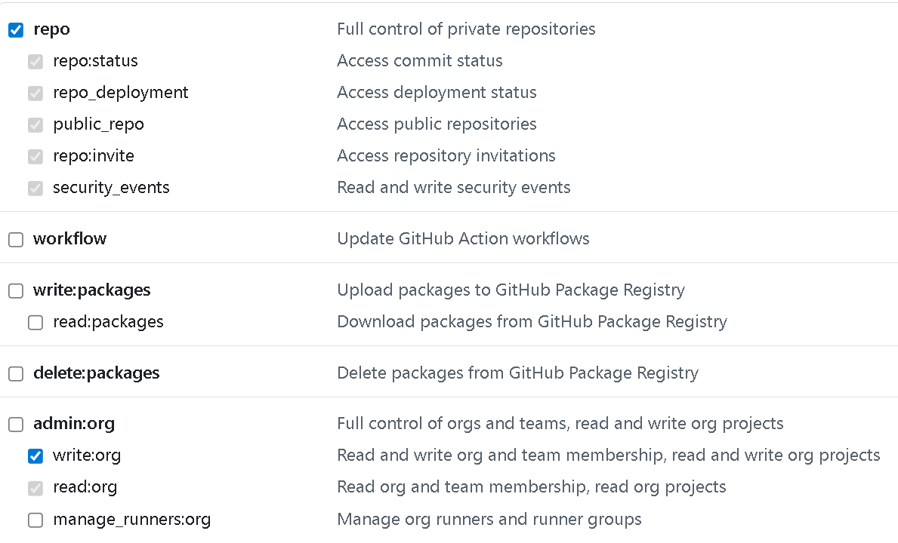
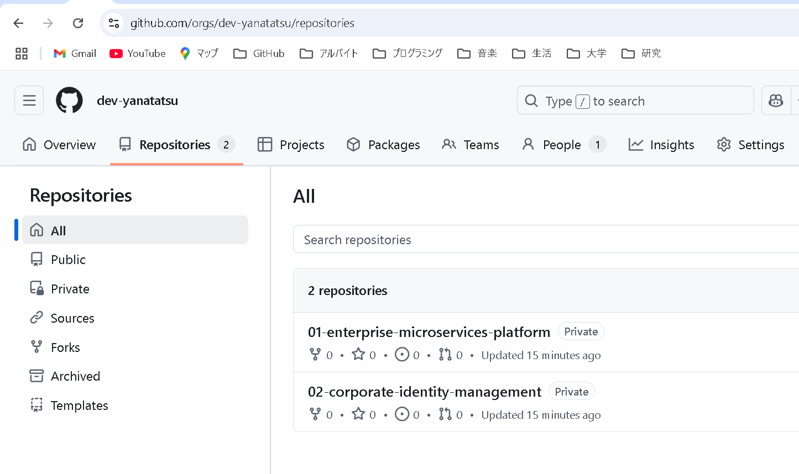

# # GitHub Repository Batch Creation with Terraform

このプロジェクトは、Terraformを使用してGitHubに複数のリポジトリを一括作成するためのコードです。

## 前提条件

- Terraform >= 1.0
- GitHub Personal Access Token (PAT)
- GitHub アカウント（個人または組織）

## 必要なPAT権限

GitHubのPersonal Access Tokenに以下の権限を付与してください：

### 個人アカウントの場合
- **repo** - リポジトリの作成・管理に必要な完全な権限

### 組織アカウントの場合
- **repo** - リポジトリの作成・管理
- **admin:org** - 組織レベルでのリポジトリ作成権限

## ファイル構成

```
.
├── main.tf                    # メインのTerraform設定
├── terraform.tfvars.example  # 設定例ファイル
├── .gitignore                # Terraformの.gitignore
└── README.md                 # このファイル
```

## セットアップ手順

### 1. 設定ファイルの準備

`terraform.tfvars.example`を`terraform.tfvars`にコピーして編集：

```bash
cp terraform.tfvars.example terraform.tfvars
```

### 2. terraform.tfvarsの設定

```hcl
# GitHub Personal Access Token
github_token = "ghp_your_actual_token_here"

# GitHub組織名（個人アカウントの場合はユーザー名）
github_organization = "your-organization-name"

# リポジトリの可視性
repository_visibility = "private"  # private, public, internal

# 作成するリポジトリ名のリスト
repository_names = [
  "project-001",
  "project-002",
  "project-003",
  # ... 最大50個まで
]
```

### 3. Terraformの実行

```bash
# 初期化
terraform init

# 実行プランの確認
terraform plan

# 適用
terraform apply
```

## 実行結果
terraform.tfvarsで設定した名前のリポジトリが作成できた



## 注意事項
### 制限事項
- GitHub APIの制限により、大量のリポジトリを一度に作成する場合は時間がかかる可能性があります
- 同名のリポジトリが既存の場合はエラーになります

